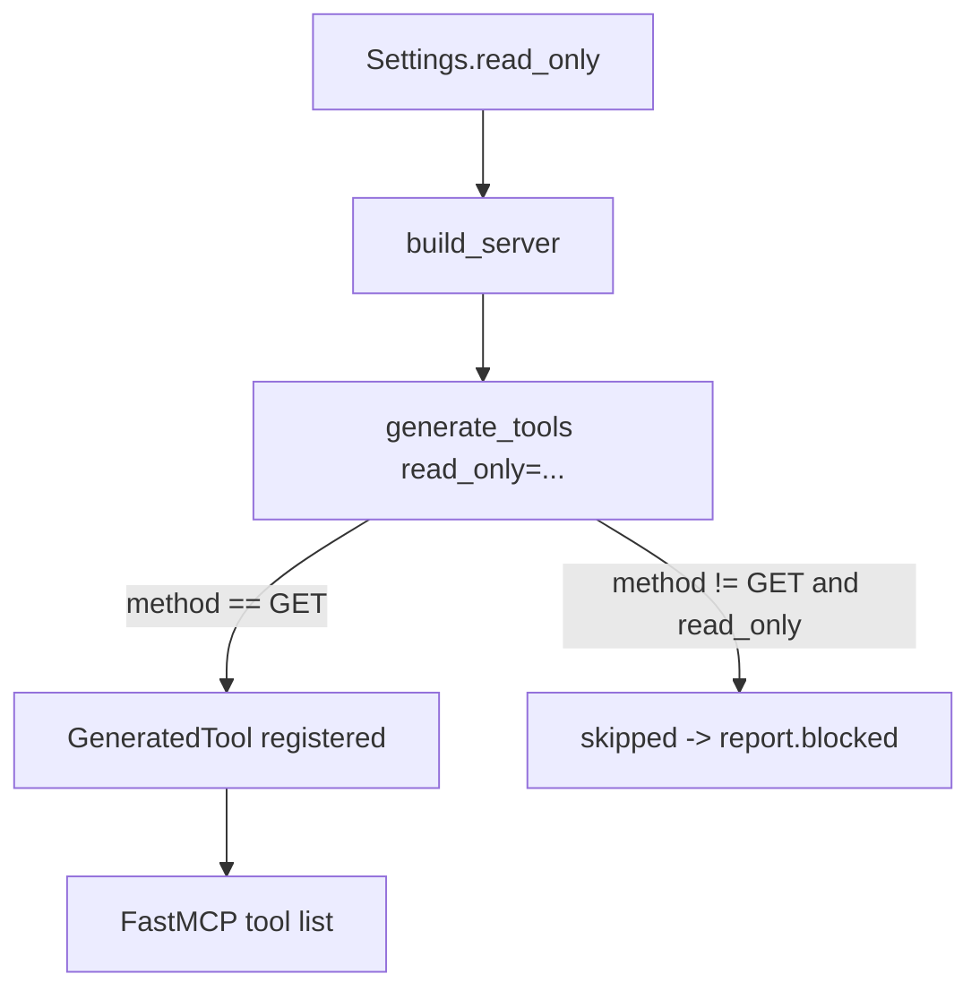

# MCP_KEYCLOCK_READ_ONLY Design

**Spec**: `.specs/features/mcp-keycloak-read-only/Specs.md`
**Status**: Draft

---

## Architecture Overview

Filter at tool-generation time, not at request time. If a write tool is never registered
with FastMCP, the LLM client never sees it as callable — simpler and safer than exposing
it and rejecting the call later.

---

## Code Reuse Analysis

### Existing Components to Leverage

| Component                      | Location                                     | How to Use                                                                                                   |
| ------------------------------ | -------------------------------------------- | ------------------------------------------------------------------------------------------------------------ |
| `Settings` (pydantic-settings) | `src/keycloak_mcp/config.py`                 | Add `read_only` field; pydantic-settings parses bool env vars (`true/1/false/0`) natively, no custom parsing |
| `generate_tools` loop          | `src/keycloak_mcp/tools/generator.py:75-104` | Add a method check before appending to `tools`, gated by new `read_only` param                               |
| `GenerationReport`             | `src/keycloak_mcp/tools/generator.py:26-28`  | Add `blocked: list[str]` field alongside `succeeded`/`failed`                                                |
| `build_server`                 | `src/keycloak_mcp/server.py:34-53`           | Pass `settings.read_only` into `generate_tools(...)`                                                         |
| `Operation` model              | `src/keycloak_mcp/openapi/models.py`         | Already carries `.method`; no change needed                                                                  |

### Integration Points

| System                        | Integration Method                                                     |
| ----------------------------- | ---------------------------------------------------------------------- |
| pydantic-settings env parsing | New field uses existing `env_prefix="MCP_KEYCLOCK_"` — no extra config |
| FastMCP tool registration     | Unaffected; still receives whatever list `generate_tools` returns      |

---

## Components

### `Settings.read_only`

- **Purpose**: Global switch restricting the server to GET-only tools.
- **Location**: `src/keycloak_mcp/config.py`
- **Interfaces**: `read_only: bool = False` (auto-bound to `MCP_KEYCLOCK_READ_ONLY`)
- **Dependencies**: pydantic-settings boolean coercion (built-in)

### `generate_tools(..., read_only: bool = False)`

- **Purpose**: Skip registering non-GET operations when read-only mode is active.
- **Location**: `src/keycloak_mcp/tools/generator.py`
- **Interfaces**: `generate_tools(operations, auth_manager, http_client, default_realm=None, read_only=False) -> tuple[list[GeneratedTool], GenerationReport]`
- **Behavior**: inside the existing per-operation `try` block, after the
  `operation_id` check and before building `GeneratedTool`, if
  `read_only and operation.method.upper() != "GET"`: log at debug/info, append
  `operation.operation_id` to `report.blocked`, `continue` (skip building/appending the
  tool). Existing GET / non-read-only path unchanged.
- **Dependencies**: `Operation.method`

### `GenerationReport.blocked`

- **Purpose**: Observability — what got hidden and why.
- **Location**: `src/keycloak_mcp/tools/generator.py`
- **Interfaces**: `blocked: list[str] = field(default_factory=list)`

### `build_server`

- **Purpose**: Wire settings into generation.
- **Location**: `src/keycloak_mcp/server.py`
- **Change**: `generate_tools(operations, auth_manager, admin_http_client, default_realm=settings.default_realm, read_only=settings.read_only)`

---

## Data Models

No new data models. `Operation.method` (existing `str`, e.g. `"GET"`, `"POST"`) is the
only field consulted; comparison is case-insensitive (`.upper() != "GET"`).

## Edge Cases

- Operation with malformed/missing method: not expected per `Operation` model contract;
  no extra handling needed beyond existing `try/except Exception` in the generation loop.
- `read_only=False` (default): behavior identical to today — `blocked` stays empty.
